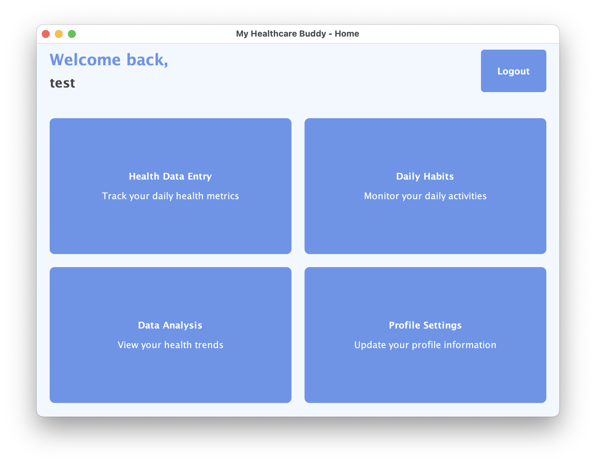
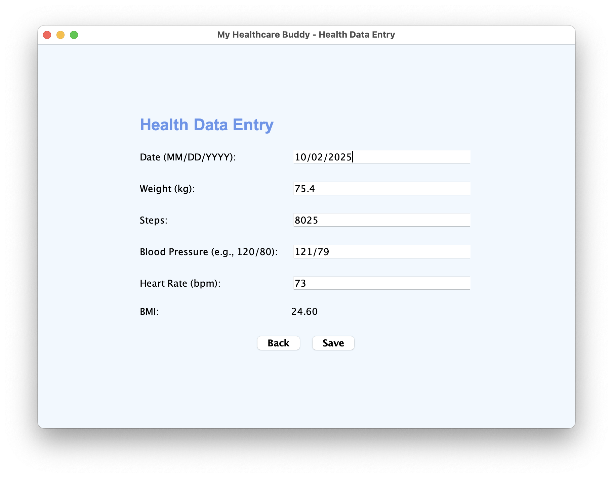
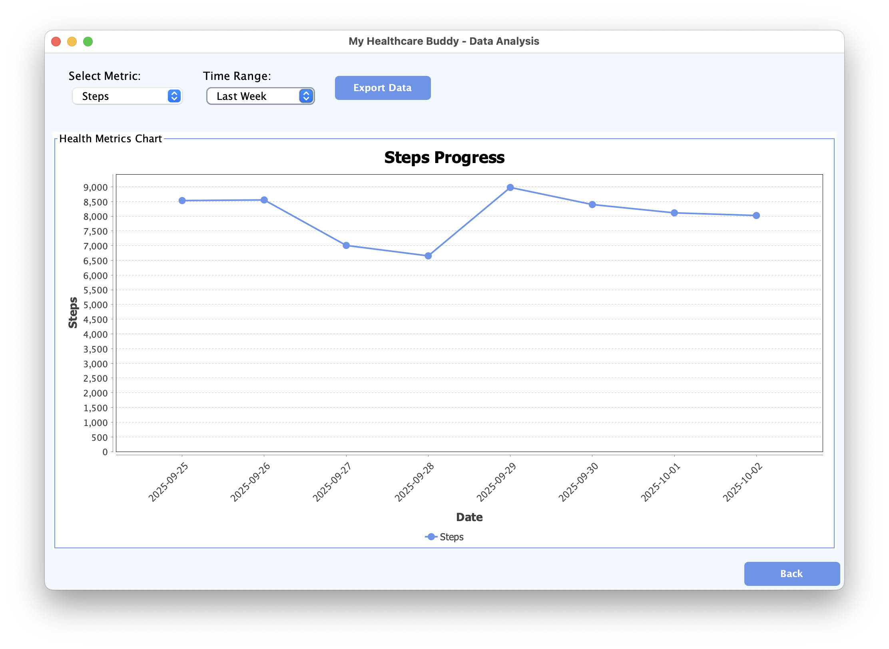

# Portfolio Deployment Guide - My Healthcare Buddy

## 🚀 Quick Setup for Portfolio Demonstration

### Option 1: GitHub Pages Deployment (Recommended)

```bash
# 1. Create a new GitHub repository
git init
git add .
git commit -m "Initial commit: My Healthcare Buddy project"
git remote add origin https://github.com/[your-username]/my-healthcare-buddy.git
git push -u origin main

# 2. Enable GitHub Pages
# Go to Settings > Pages > Source: Deploy from a branch > main branch

# 3. Create index.html in root directory (see template below)
```

### Option 2: Netlify Deployment

```bash
# 1. Push to GitHub first (see Option 1)

# 2. Connect account to Netlify.com
# - New site from Git
# - Choose your repository
# - Build command: (leave empty for static)
# - Publish directory: . (root)

# 3. Add custom domain if desired
```

### Option 3: Vercel Deployment

```bash
# 1. Install Vercel CLI
npm i -g vercel

# 2. Initialize deployment
vercel

# 3. Follow prompts and deploy
```

---

## 🌐 Portfolio Website Integration

### HTML Template for Project Page

Create `index.html` in your project root:

```html
<!DOCTYPE html>
<html lang="en">
<head>
    <meta charset="UTF-8">
    <meta name="viewport" content="width=device-width, initial-scale=1.0">
    <title>My Healthcare Buddy - Portfolio Project</title>
    <style>
        * { margin: 0; padding: 0; box-sizing: border-box; }
        body { font-family: -apple-system, BlinkMacSystemFont, 'Segoe UI', Roboto, sans-serif; line-height: 1.6; color: #333; }
        .container { max-width: 1200px; margin: 0 auto; padding: 20px; }
        .hero { text-align: center; padding: 60px 0; background: linear-gradient(135deg, #667eea 0%, #764ba2 100%); color: white; }
        .hero h1 { font-size: 3rem; margin-bottom: 20px; }
        .hero p { font-size: 1.2rem; margin-bottom: 30px; }
        .btn { display: inline-block; padding: 12px 30px; background: #3498db; color: white; text-decoration: none; border-radius: 5px; margin: 10px; }
        .btn:hover { background: #2980b9; }
        .section { padding: 60px 0; }
        .features { display: grid; grid-template-columns: repeat(auto-fit, minmax(300px, 1fr)); gap: 30px; }
        .feature { padding: 30px; background: #f8f9fa; border-radius: 10px; }
        .screenshots { display: grid; grid-template-columns: repeat(auto-fit, minmax(250px, 1fr)); gap: 20px; margin-top: 30px; }
        .screenshot { border-radius: 10px; overflow: hidden; box-shadow: 0 5px 15px rgba(0,0,0,0.1); }
        .screenshot img { width: 100%; height: auto; }
        .tech-stack { display: flex; flex-wrap: wrap; gap: 10px; margin-top: 20px; }
        .tech-tag { background: #e74c3c; color: white; padding: 5px 15px; border-radius: 20px; font-size: 0.9rem; }
        .highlight { background: #fff3cd; padding: 20px; border-left: 4px solid #ffc107; margin: 20px 0; }
    </style>
</head>
<body>
    <header class="hero">
        <div class="container">
            <h1>My Healthcare Buddy</h1>
            <p>A comprehensive Java desktop application for personal health management</p>
            <a href="#demo" class="btn">View Live Demo</a>
            <a href="https://github.com/[your-username]/my-healthcare-buddy" class="btn">View Source Code</a>
        </div>
    </header>

    <section class="section">
        <div class="container">
            <h2>🚀 Project Overview</h2>
            <p>My Healthcare Buddy is a feature-rich Java desktop application that demonstrates proficiency in full-stack development, security implementation, and professional software engineering practices. Built using Java Swing and SQLite, it provides a complete solution for personal health data management.</p>
            
            <div class="highlight">
                <h3>🎯 Key Achievements</h3>
                <ul>
                    <li>Implemented secure authentication with SHA-256 password hashing</li>
                    <li>Built comprehensive data validation framework</li>
                    <li>Created interactive data visualization with JFreeChart</li>
                    <li>Developed professional error handling and logging system</li>
                    <li>Designed intuitive UI/UX with consistent styling</li>
                </ul>
            </div>
        </div>
    </section>

    <section class="section id="demo">
        <div class="container">
            <h2>📸 Screenshots</h2>
            <div class="screenshots">
                <div class="screenshot">
                    
                    <p style="padding: 15px; text-align: center;">Secure Login Interface</p>
                </div>
                <div class="screenshot">
                    
                    <p style="padding: 15px; text-align: center;">Main Dashboard</p>
                </div>
                <div class="screenshot">
                    
                    <p style="padding: 15px; text-align: center;">Health Data Entry</p>
                </div>
                <div class="screenshot">
                    
                    <p style="padding: 15px; text-align: center;">Data Visualization</p>
                </div>
            </div>
        </div>
    </section>

    <section class="section">
        <div class="container">
            <h2>✨ Features Implemented</h2>
            <div class="features">
                <div class="feature">
                    <h3>🔐 Secure Authentication</h3>
                    <p>SHA-256 password hashing with randomized salt, comprehensive input validation, and secure session management.</p>
                </div>
                <div class="feature">
                    <h3>📊 Health Data Tracking</h3>
                    <p>Complete health metrics monitoring including weight, BMI, steps, blood pressure, and heart rate with automatic calculations.</p>
                </div>
                <div class="feature">
                    <h3>📈 Data Visualization</h3>
                    <p>Interactive charts powered by JFreeChart library for analyzing health trends and patterns across multiple time periods.</p>
                </div>
                <div class="feature">
                    <h3>🎯 Goal Management</h3>
                    <p>Personal wellness targets and progress monitoring with visual indicators and achievement tracking.</p>
                </div>
                <div class="feature">
                    <h3>☕ Daily Habits</h3>
                    <p>Track water intake, diet choices, and sleep patterns with calendar-based data entry system.</p>
                </div>
                <div class="feature">
                    <h3>💾 Data Export</h3>
                    <p>CSV export functionality for external data analysis and backup purposes.</p>
                </div>
            </div>
        </div>
    </section>

    <section class="section">
        <div class="container">
            <h2>💻 Technical Implementation</h2>
            <h3>Technology Stack</h3>
            <div class="tech-stack">
                <span class="tech-tag">Java 11</span>
                <span class="tech-tag">Swing GUI</span>
                <span class="tech-tag">SQLite</span>
                <span class="tech-tag">JFreeChart</span>
                <span class="tech-tag">Maven</span>
                <span class="tech-tag">SHA-256 Security</span>
                <span class="tech-tag">Git</span>
            </div>
            
            <h3 style="margin-top: 30px;">Architecture Highlights</h3>
            <ul style="margin-top: 15px;">
                <li><strong>MVC Pattern:</strong> Clean separation of presentation, business logic, and data access layers</li>
                <li><strong>Security-First Design:</strong> Comprehensive password protection and input validation</li>
                <li><strong>Error Handling:</strong> Professional-grade error management with user-friendly messaging</li>
                <li><strong>Database Design:</strong> Normalized schema with foreign key constraints and data integrity</li>
                <li><strong>UI/UX Design:</strong> Consistent styling with custom components and responsive layouts</li>
            </ul>
        </div>
    </section>

    <section class="section">
        <div class="container">
            <h2>🚀 Get Started</h2>
            <h3>Try It Yourself</h3>
            <div style="background: #f8f9fa; padding: 30px; border-radius: 10px; margin-top: 20px;">
                <h4>Quick Start</h4>
                <pre style="background: #2c3e50; color: #ecf0f1; padding: 20px; border-radius: 5px; overflow-x: auto;"><code># Clone the repository
git clone https://github.com/[your-username]/my-healthcare-buddy.git
cd my-healthcare-buddy

# Build the project
mvn clean package

# Run the application
java -jar target/my-healthcare-buddy-1.0-SNAPSHOT.jar

# Default login: test/test123</code></pre>
            </div>
            
            <div style="margin-top: 30px;">
                <h4>System Requirements</h4>
                <ul>
                    <li>Java 11 or higher</li>
                    <li>Maven 3.6+ (for building from source)</li>
                    <li>2GB RAM minimum</li>
                    <li>Cross-platform compatibility (Windows, macOS, Linux)</li>
                </ul>
            </div>
        </div>
    </section>

    <footer style="background: #2c3e50; color: white; padding: 40px 0; text-align: center; margin-top: 60px;">
        <div class="container">
            <p>Built with ❤️ using modern Java development practices</p>
            <p style="margin-top: 10px;">
                <a href="https://github.com/[your-username]/my-healthcare-buddy" style="color: #3498db;">View Source</a> • 
                <a href="INSTALL.md" style="color: #3498db;">Installation Guide</a> • 
                <a href="README.md" style="color: #3498db;">Documentation</a>
            </p>
        </div>
    </footer>
</body>
</html>
```

---

## 📱 Demo Video Creation

### Recording Software Options

**Free Options:**
- **macOS**: QuickTime Player (built-in) or OBS Studio
- **Windows**: Xbox Game Bar (built-in) or OBS Studio  
- **Linux**: SimpleScreenRecorder or OBS Studio

**Professional Options:**
- **Loom** (browser-based, free tier available)
- **Camtasia** (paid, professional features)
- **ScreenFlow** (macOS, paid)

### Demo Script (5 minutes)

```markdown
1. Introduction (30 seconds)
   - "Hi, I'm [your name], and today I'm showcasing My Healthcare Buddy"
   - "A Java desktop application I built for personal health management"

2. Application Launch (30 seconds)
   - Show project structure and build process
   - Launch the application
   - Show professional startup

3. Key Features Demo (3 minutes)
   - Login with secure authentication
   - Navigate through dashboard
   - Demonstrate health data entry with validation
   - Show data visualization charts
   - Export functionality demo

4. Technical Highlights (1 minute)
   - Mention security implementation
   - Discuss architecture choices
   - Show code organization

5. Conclusion (30 seconds)
   - Recap key features
   - Mention GitHub link
   - Thank viewers
```

---

## 🔗 GitHub Repository Setup

### Repository Settings

1. **Add Topics** (Settings → General → Topics)
```
health-management
java-swing
desktop-application
sqlite
data-visualization
healthcare-tech
maven-project
portfolio-project
```

2. **Enable Features**
- ✅ Issues
- ✅ Wiki  
- ✅ Discussions
- ✅ Projects
- ✅ Security alerts

3. **Repository Description**
```
🏥 My Healthcare Buddy - A comprehensive Java desktop application for personal health management with secure authentication, data visualization, and professional error handling. Built with Swing, SQLite, and Maven.
```

### README Badges

Add these badges to your README.md:

```markdown


```

---

## 📸 Screenshot Checklist

### Required Screenshots
- [ ] **Login Screen** - Clean authentication interface
- [ ] **Dashboard** - Main navigation hub  
- [ ] **Health Data Entry** - Form with validation
- [ ] **Daily Habits** - Calendar-based tracking
- [ ] **Data Visualization** - Charts and trends
- [ ] **Profile Settings** - User management
- [ ] **Export Function** - CSV generation

### Screenshot Tips
- Use high resolution (1920x1080 minimum)
- Clean desktop backgrounds
- Sample data (not personal information)
- Consistent browser/application windows
- Save as PNG for best quality
- Create variations for different sections

---

## 🎯 Portfolio Integration Checklist

### Before Adding to Portfolio
- [ ] Complete all documentation
- [ ] Test on different platforms
- [ ] Create compelling screenshots
- [ ] Record demonstration video
- [ ] Write project summary
- [ ] Prepare code samples
- [ ] Set up GitHub repository
- [ ] Create portfolio page/deployment

### Ongoing Maintenance
- [ ] Keep screenshots current
- [ ] Update documentation
- [ ] Respond to GitHub issues
- [ ] Monitor portfolio analytics
- [ ] Gather feedback for improvements

---

This comprehensive deployment guide ensures your My Healthcare Buddy project will make a professional impression in your portfolio!
