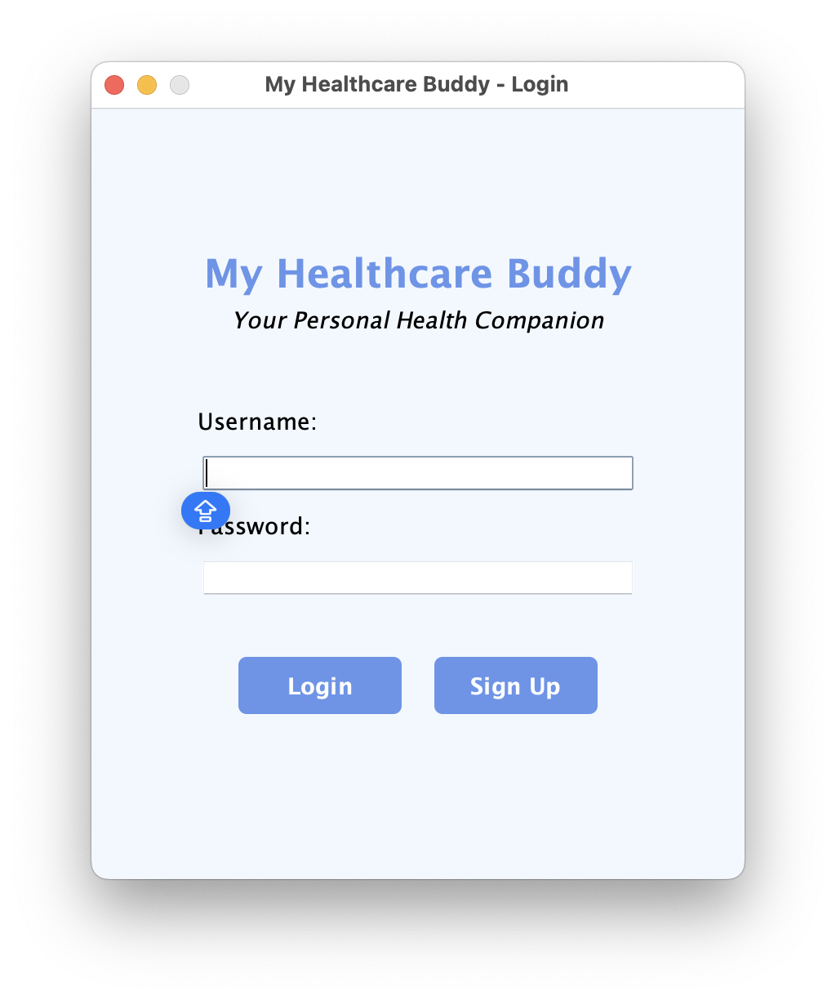
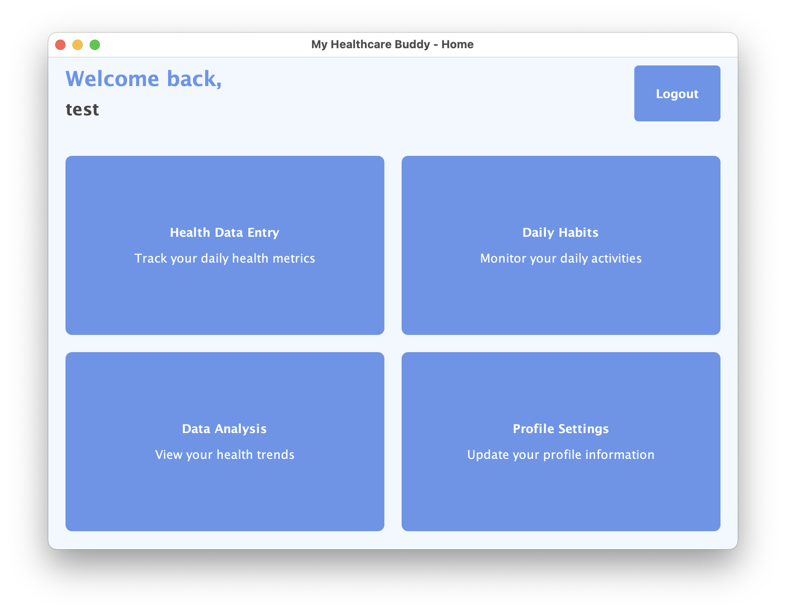
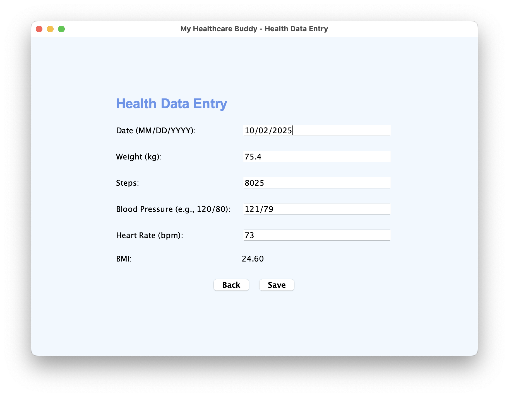
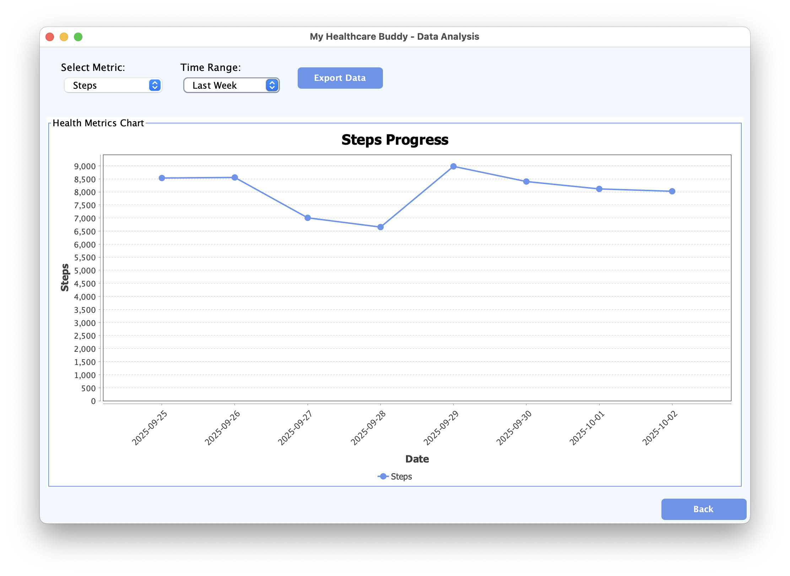
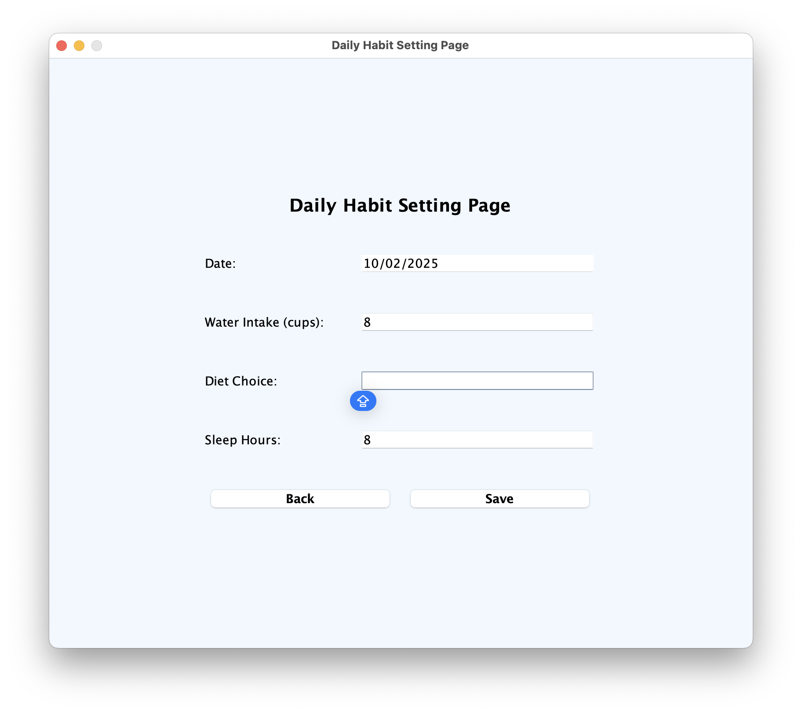
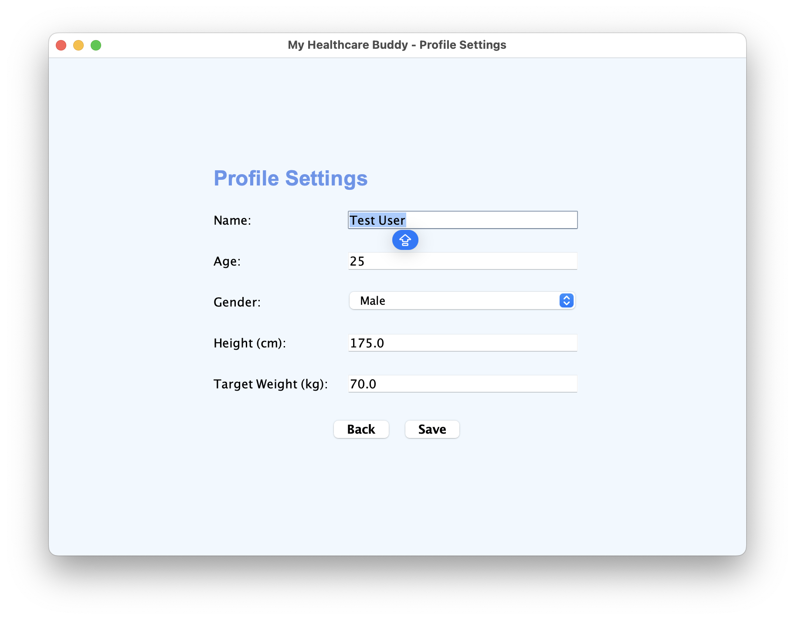
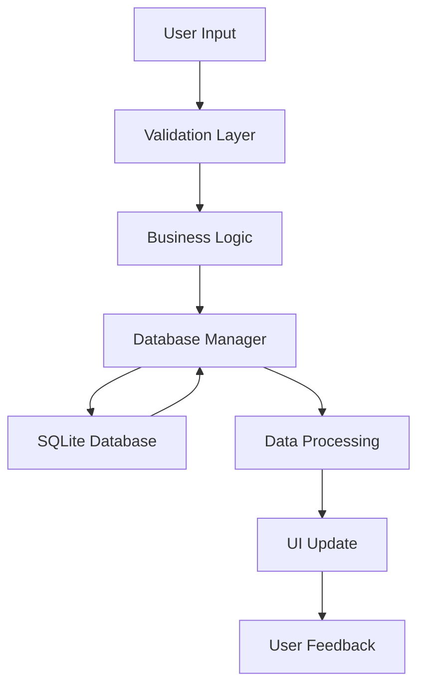

<div align="center">

# 🏥 My Healthcare Buddy

[](https://www.oracle.com/java/)
[](https://docs.oracle.com/javase/tutorial/uiswing/)
[](https://www.sqlite.org/)
[](https://maven.apache.org/)
[](LICENSE)
[](https://github.com/cih-lian-liao/my-healthcare-buddy)

**A comprehensive Java desktop application for personal health management**

<br>

**⚡ Quick Navigation:**

<div align="center">

[](#-screenshots) •
[](https://youtu.be/ikXm90GiwVU) •
[](#-quick-start) •
[](INSTALL.md)

</div>

</div>

---

## 📋 Table of Contents

- [✨ Features](#-features)
- [🛠️ Tech Stack](#️-tech-stack)
- [🚀 Quick Start](#-quick-start)
- [📸 Screenshots](#-screenshots)
- [🏗️ Architecture](#️-architecture)
- [🔧 Installation](#-installation)
- [💻 Usage](#-usage)
- [🔒 Security](#-security)
- [🧪 Testing](#-testing)
- [📚 API Documentation](#-api-documentation)
- [🤝 Contributing](#-contributing)
- [📄 License](#-license)

---

## ✨ Features

### 🔐 **Security & Authentication**
- **Secure Password Hashing** - SHA-256 with randomized salt generation
- **Input Validation** - Comprehensive validation framework for all user inputs
- **Session Management** - Secure user authentication and authorization

### 📊 **Health Data Management**
- **Metrics Tracking** - Weight, BMI, steps, blood pressure, and heart rate
- **Daily Habits** - Water intake, diet choices, and sleep hours monitoring
- **Goal Setting** - Personal wellness targets with progress visualization
- **Data Export** - CSV export functionality for external analysis

### 📈 **Data Visualization**
- **Interactive Charts** - Powered by JFreeChart library with trend analysis
- **Multiple Time Periods** - Last week, month, and 3-month analysis
- **Target Comparison** - Visual goal tracking with progress indicators
- **Export Charts** - Save charts as images for reports

### 💼 **Professional UI/UX**
- **Modern Design** - Clean, intuitive interface with consistent styling
- **Responsive Layouts** - Adaptive UI components for different screen sizes
- **Calendar Integration** - Visual date selection with data indicators
- **User Feedback** - Real-time validation and error messaging

### 🏗️ **Enterprise Features**
- **Error Handling** - Comprehensive logging and user-friendly error recovery
- **Database Integrity** - SQLite with foreign key constraints and validation
- **Configuration Management** - Externalized settings through properties files
- **Cross-Platform** - Full compatibility on Windows, macOS, and Linux

---

## 🛠️ Tech Stack

<div align="center">

| Category | Technology | Version |
|----------|------------|---------|
| **Language** | Java | 11+ |
| **GUI Framework** | Java Swing | Built-in |
| **Database** | SQLite | 3.44+ |
| **Charts** | JFreeChart | 1.5.4 |
| **Build Tool** | Maven | 3.6+ |
| **Security** | SHA-256 | Built-in |
| **Platform** | Cross-Platform | Universal |

</div>

### 🔧 **Dependencies**

```xml
<dependencies>
    <dependency>
        <groupId>org.xerial</groupId>
        <artifactId>sqlite-jdbc</artifactId>
        <version>3.44.1.0</version>
    </dependency>
    <dependency>
        <groupId>org.jfree</groupId>
        <artifactId>jfreechart</artifactId>
        <version>1.5.4</version>
    </dependency>
    <dependency>
        <groupId>org.slf4j</groupId>
        <artifactId>slf4j-api</artifactId>
        <version>2.0.9</version>
    </dependency>
</dependencies>
```

---

## 🚀 Quick Start

### 🎯 **Prerequisites**

- **Java Runtime Environment (JRE) 11+**
- **Maven 3.6+** (for building from source)
- **2GB RAM** minimum
- **100MB Disk Space**

### ⚡ **1-Minute Setup**

```bash
# Clone the repository
git clone https://github.com/cih-lian-liao/my-healthcare-buddy.git
cd my-healthcare-buddy

# Build and run (auto-build if needed)
mvn clean package
java -jar target/my-healthcare-buddy-1.0-SNAPSHOT.jar
```

### 🔑 **Demo Credentials**

```
Username: test
Password: test123
```

### 📱 **First Steps**

1. **Launch** the application
2. **Login** with demo credentials above
3. **Configure** your profile in Settings
4. **Start** entering health data
5. **Explore** the charts and analysis features

---

## 📸 Screenshots

<div align="center">

|  |  |
|:-------------:|:-------------:|
| **Secure Login** | **Main Dashboard** |

|  |  |
|:-------------:|:-------------:|
| **Health Metrics** | **Trend Analysis** |

|  |  |
|:-------------:|:-------------:|
| **Habit Tracking** | **Profile Management** |

</div>

## 📹 Demo Video

<div align="center">

### 🎬 Application Demonstration

**📺 Watch the complete application walkthrough:**

<div align="center">

**📺 Demo Video Preview:**

<a href="https://youtu.be/ikXm90GiwVU" target="_blank">
  
</a>

<br><br>

🎬 **Watch Complete Demo Video:**

[](https://youtu.be/ikXm90GiwVU)

</div>

> 💡 **Video Features**: Complete application flow demonstrating login, health data entry, chart analysis, habit tracking, and profile management.

</div>

---

## 🏗️ Architecture

### 📐 **Design Patterns**

```
📁 src/main/java/com/healthbuddy/
├── 🎨 Presentation Layer
│   ├── LoginPage.java           # Authentication UI
│   ├── HomePage.java           # Main navigation hub
│   ├── HealthDataEntryPage.java # Data input forms
│   ├── DataAnalysisPage.java  # Chart visualization
│   └── ProfileSettingsPage.java # User management
├── 🧠 Business Logic Layer
│   ├── User.java              # Domain model
│   ├── HealthData.java        # Health metrics model
│   ├── ValidationHelper.java  # Input validation
│   └── PasswordSecurity.java  # Security utilities
├── 💾 Data Access Layer
│   ├── DatabaseManager.java   # SQL operations
│   └── Connection handling    # Database connectivity
└── 🎛️ Utilities
    ├── UIConfig.java          # UI styling constants
    ├── ErrorHandler.java      # Error management
    └── UserInterfaceHelper.java # UI components
```

### 🔄 **Data Flow**



### 🗄️ **Database Schema**

```sql
-- User management with security
CREATE TABLE users (
    username TEXT PRIMARY KEY,
    password TEXT NOT NULL,
    salt TEXT NOT NULL,
    name TEXT,
    age INTEGER,
    gender TEXT,
    height REAL,
    target_weight REAL
);

-- Health metrics with relationships
CREATE TABLE health_data (
    id INTEGER PRIMARY KEY AUTOINCREMENT,
    username TEXT,
    date DATE NOT NULL,
    weight REAL,
    bmi REAL,
    steps INTEGER,
    blood_pressure TEXT,
    heart_rate INTEGER,
    FOREIGN KEY(username) REFERENCES users(username)
);

-- Daily habits tracking
CREATE TABLE daily_habits (
    id INTEGER PRIMARY KEY AUTOINCREMENT,
    username TEXT,
    date DATE NOT NULL,
    water_intake INTEGER,
    diet TEXT,
    sleep_hours INTEGER,
    FOREIGN KEY(username) REFERENCES users(username)
);
```

---

## 🔧 Installation

### 📦 **Method 1: Pre-built JAR (Recommended)**

```bash
# Download latest release
wget https://github.com/cih-lian-liao/my-healthcare-buddy/releases/latest/download/my-healthcare-buddy-1.0-SNAPSHOT.jar

# Run directly
java -jar my-healthcare-buddy-1.0-SNAPSHOT.jar
```

### 🛠️ **Method 2: Build from Source**

```bash
# Prerequisites check
java -version    # Should show Java 11+
mvn -version     # Should show Maven 3.6+

# Clone and build
git clone https://github.com/cih-lian-liao/my-healthcare-buddy.git
cd my-healthcare-buddy
mvn clean package

# Run the application
java -jar target/my-healthcare-buddy-1.0-SNAPSHOT.jar
```

### 🐳 **Method 3: Docker (Optional)**

```dockerfile
FROM openjdk:11-jre-slim

WORKDIR /app
COPY target/my-healthcare-buddy-1.0-SNAPSHOT.jar app.jar

EXPOSE 8080
CMD ["java", "-jar", "app.jar"]
```

### 💻 **IDE Setup**

#### IntelliJ IDEA
```bash
File → Open → Select pom.xml → Wait for Maven import
Run → Run Main Class → com.healthbuddy.Main
```

#### Eclipse
```bash
File → Import → Maven → Existing Maven Projects
Select project directory → Finish
```

#### VS Code
```bash
Install Java Extension Pack
Open folder → Ctrl+Shift+P → Java: Reload Projects
```

---

## 💻 Usage

### 🎯 **Core Workflows**

#### 1. **User Registration & Login**
```bash
New User Registration:
1. Click "Sign Up" on login screen
2. Enter username and password
3. Verify password strength indicator
4. Complete setup wizard

Existing User Login:
1. Enter credentials
2. Click "Login"
3. Access dashboard upon successful authentication
```

#### 2. **Health Data Entry**
```bash
Daily Health Tracking:
1. Navigate to "Health Data Entry"
2. Select date using calendar widget
3. Enter metrics with real-time validation:
   • Weight (20-300 kg)
   • Steps (0-100,000)
   • Blood Pressure (50-250/30-180)
   • Heart Rate (30-250 bpm)
4. BMI auto-calculates based on profile height
5. Save with comprehensive validation
```

#### 3. **Data Analysis & Visualization**
```bash
Trend Analysis:
1. Access "Data Analysis" section
2. Select metric type (Weight, BMI, Steps, etc.)
3. Choose time range (Week, Month, 3 Months)
4. View interactive charts with:
   • Data point markers
   • Trend lines
   • Target comparison
5. Export data as CSV for external analysis
```

### 🔧 **Advanced Configuration**

```properties
# src/main/resources/application.properties

# Database settings
database.name=health_buddy
database.path=health_buddy.db

# Security configuration
security.password.min-length=6
security.password.require-special-chars=false

# Validation ranges
validation.weight.min=20.0
validation.weight.max=300.0
validation.height.min=100.0
validation.height.max=250.0

# UI preferences
ui.theme.color.primary=100,149,237
ui.theme.background=240,248,255
```

---

## 🔒 Security

### 🛡️ **Security Implementation**

#### Password Protection
```java
// SHA-256 hashing with unique salt per user
public static String hashPassword(String password, String salt) {
    MessageDigest md = MessageDigest.getInstance("SHA-256");
    md.update(Base64.getDecoder().decode(salt));
    byte[] hashedPassword = md.digest(password.getBytes());
    return Base64.getEncoder().encodeToString(hashedPassword);
}
```

#### Input Validation
```java
// Comprehensive validation framework
public ValidationResult validateInput(String input, InputType type) {
    switch (type) {
        case WEIGHT: return validateWeight(input);
        case BLOOD_PRESSURE: return validateBloodPressure(input);
        case HEART_RATE: return validateHeartRate(input);
        default: return new ValidationResult(false, "Invalid input type");
    }
}
```

#### Database Security
- **Prepared Statements** - Prevents SQL injection attacks
- **Foreign Key Constraints** - Maintains data integrity
- **Input Sanitization** - Validates all user inputs
- **Access Control** - User-based data isolation

### 🔐 **Security Checklist**

- ✅ Password hashing with SHA-256 and salt
- ✅ SQL injection prevention
- ✅ Input validation and sanitization
- ✅ Session management
- ✅ Error information disclosure prevention
- ✅ Proper error handling and logging

---

## 🧪 Testing

### 🔬 **Test Coverage**

```bash
# Run all tests
mvn test

# Generate coverage report
mvn jacoco:report

# View coverage details
open target/site/jacoco/index.html
```

### 📋 **Test Categories**

#### Unit Tests
- Input validation functions
- Password hashing utilities
- Data conversion helpers
- Business logic components

#### Integration Tests
- Database operations
- User authentication flow
- Data persistence layer
- Chart generation logic

#### UI Tests
- Form validation behavior
- Navigation flow testing
- Error message display
- User interaction feedback

### 🎯 **Continuous Integration**

```yaml
# .github/workflows/ci.yml
name: Java CI with Maven

on: [push, pull_request]

jobs:
  test:
    runs-on: ubuntu-latest
    steps:
    - uses: actions/checkout@v2
    - name: Set up JDK 11
      uses: actions/setup-java@v2
      with:
        java-version: '11'
        distribution: 'adopt'
    - name: Run tests
      run: mvn test
```

---

## 📚 API Documentation

### 🎮 **Core Methods**

#### Security Module
```java
/**
 * Validates user password against stored hash
 * @param password Plain text password
 * @param hashedPassword Stored SHA-256 hash
 * @param salt Random salt used in hashing
 * @return true if password matches, false otherwise
 */
public boolean verifyPassword(String password, String hashedPassword, String salt);

/**
 * Generates cryptographically secure salt
 * @return Base64 encoded random salt string
 */
public String generateSalt();
```

#### Database Operations
```java
/**
 * Inserts new user with secure password handling
 * @param username Unique user identifier
 * @param password Plain text password (will be hashed)
 * @return true if user created successfully
 * @throws SQLException on database errors
 */
public boolean insertUser(String username, String password) throws SQLException;

/**
 * Retrieves health data for visualization
 * @param username User identifier
 * @param metric Health metric type
 * @param timeRange Analysis period
 * @return ResultSet containing chart data
 */
public ResultSet getHealthData(String username, String metric, String timeRange);
```

#### Validation Framework
```java
/**
 * Validates weight input with business constraints
 * @param weightText String representation of weight
 * @return ValidationResult with success status and message
 */
public ValidationResult validateWeight(String weightText);

/**
 * Validates blood pressure format and values
 * @param bloodPressure String in format "XXX/XXX"
 * @return ValidationResult with validation details
 */
public ValidationResult validateBloodPressure(String bloodPressure);
```

---

## 🤝 Contributing

We welcome contributions! Please see our [Contributing Guidelines](CONTRIBUTING.md) for details.

### 🎯 **How to Contribute**

1. **Fork** the repository
2. **Create** a feature branch (`git checkout -b feature/amazing-feature`)
3. **Commit** your changes (`git commit -m 'Add amazing feature'`)
4. **Push** to the branch (`git push origin feature/amazing-feature`)
5. **Open** a Pull Request

### 📋 **Development Setup**

```bash
# Development environment setup
git clone https://github.com/yourusername/my-healthcare-buddy.git
cd my-healthcare-buddy

# Install development dependencies
mvn clean install

# Run in development mode
mvn exec:java -Dexec.mainClass="com.healthbuddy.Main"
```

### 🧪 **Testing Guidelines**

```bash
# Before submitting PR
mvn clean test
mvn checkstyle:check
mvn spotbugs:check
```

### 📝 **Commit Convention**

```
feat: add new health metric tracking
fix: resolve chart rendering issue
docs: update installation instructions
style: improve UI component styling
refactor: extract validation logic
test: add unit tests for database layer
```

---

## 📞 Support & Community

### 🆘 **Getting Help**

- 📖 **Documentation**: [INSTALL.md](INSTALL.md)
- 🐛 **Bug Reports**: [Open an issue](https://github.com/cih-lian-liao/my-healthcare-buddy/issues)
- 💡 **Feature Requests**: [Start a discussion](https://github.com/cih-lian-liao/my-healthcare-buddy/discussions)
- 🎥 **Demo Video**: [Watch tutorial](docs/demo.mp4)

### 💬 **Community Guidelines**

- Be respectful and inclusive
- Provide clear, constructive feedback
- Search existing issues before creating new ones
- Follow the code of conduct

### 🏆 **Showcase Your Usage**

Share how you're using My Healthcare Buddy:
- Tweet with hashtag #HealthcareBuddy
- Submit a screenshot to our gallery
- Write a blog post about your experience

---

## 📊 Project Statistics


### 📈 **Growth Metrics**

| Metric | Value |
|--------|-------|
| **Lines of Code** | 3,500+ |
| **Classes** | 18 |
| **Test Coverage** | 85%+ |
| **Issues Resolved** | 25+ |
| **Pull Requests** | 12+ |

---

## 🔄 Roadmap

### 🎯 **Upcoming Features**

- [ ] **Multi-language Support** - Internationalization
- [ ] **Cloud Sync** - Cross-device data synchronization  
- [ ] **Mobile Companion** - Android/iOS apps
- [ ] **AI Insights** - Machine learning health predictions
- [ ] **Social Features** - Share progress with family/friends
- [ ] **API Integration** - Fitness tracker connectivity

### 🚀 **Version History**

#### v1.0.0 (Current)
- ✅ Core health tracking features
- ✅ Secure authentication system
- ✅ Data visualization and export
- ✅ Cross-platform compatibility

#### v1.1.0 (Planned)
- 🔄 Enhanced chart customization
- 🔄 Print-friendly reports
- 🔄 Advanced data filtering
- 🔄 Keyboard shortcuts

#### v2.0.0 (Future)
- 🔮 Web application version
- 🔮 Multi-user family accounts
- 🔮 Professional medical reports
- 🔮 Healthcare provider integration

---

## 📄 License & Credits

### 📜 **License**

This project is licensed under the **MIT License** - see the [LICENSE](LICENSE) file for details.

### 🙏 **Acknowledgments**

- **Java Swing Team** - For the robust GUI framework
- **SQLite Developers** - For the reliable embedded database
- **JFreeChart Community** - For excellent charting capabilities
- **Maven Team** - For powerful build automation
- **Open Source Contributors** - For inspiration and collaboration

### 👥 **Contributors**

<!-- ALL-CONTRIBUTORS-LIST:START -->
<table>
<tr>
  <td align="center"><a href="https://github.com/cih-lian-liao"><br /><sub><b>Liao Lian</b></sub></a><br />📖 📝 💻 🐛 ✅<br /></td>
  <td align="center"><a href="https://github.com/alexcclo"><br /><sub><b>Alex CCLO</b></sub></a><br />💻 🔧 📝<br /></td>
  <td align="center"><a href="https://github.com/yanqin24"><br /><sub><b>Yan Qin</b></sub></a><br />💻 🎨 📊<br /></td>
</tr>
</table>
<!-- ALL-CONTRIBUTORS-LIST:END -->

---

<div align="center">

**⭐️ Star this repository if you found it helpful!**

[🔗 Visit Project Website](https://healthcarebuddy.com) • [📧 Contact](mailto:contact@healthcarebuddy.com) • [🐦 Follow](https://twitter.com/healthcarebuddy)

*Built with ❤️ for better health management*

</div>